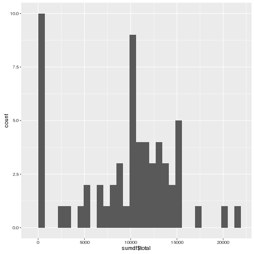

## Load some libraries

```r
library(dplyr)
##library(tidyr)
library(ggplot2)
```

## Loading and preprocessing the data
Load the data file

```r
df <- read.csv("activity.csv")
```

Convert the date column to the date class

```r
df$date <- as.Date(df$date)
```

## What is mean total number of steps taken per day?

Group the data by date and apply the dplyr summarize function to
calculate the total number of steps taken per day

```r
groups <- group_by(df,date)
sumdf <- summarise(groups,total=sum(steps,na.rm=TRUE))
```

Here is a histogram of the total number of steps taken each day

```r
ggplot(data=sumdf, aes(sumdf$total)) + geom_histogram()
```

```
## `stat_bin()` using `bins = 30`. Pick better value with `binwidth`.
```

 

The mean of the total number of steps taken per day is 9354.2295082.

The median of the total number of steps taken per day is 10395.

## What is the average daily activity pattern?


## Imputing missing values


## Are there differences in activity patterns between weekdays and weekends?
