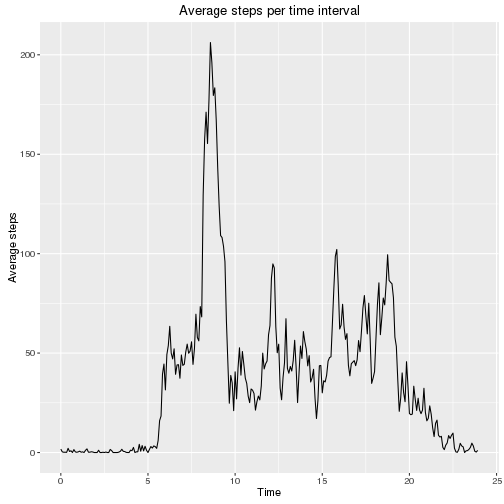
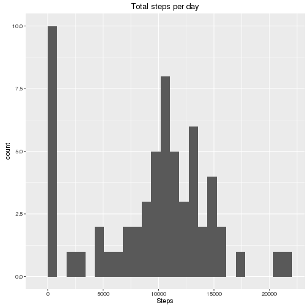
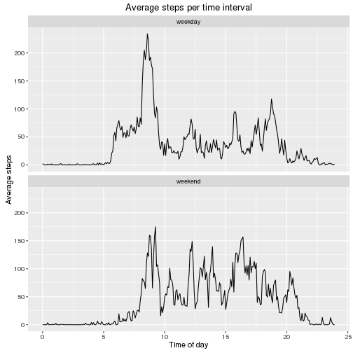

## Load some libraries

```r
library(stringr)
library(dplyr)
```

```
## 
## Attaching package: 'dplyr'
## 
## The following objects are masked from 'package:stats':
## 
##     filter, lag
## 
## The following object is masked from '.startup':
## 
##     n
## 
## The following objects are masked from 'package:base':
## 
##     intersect, setdiff, setequal, union
```

```r
library(lubridate)
library(ggplot2)
```

## Loading and preprocessing the data
Load the data file

```r
df <- read.csv("activity.csv")
```

Manipulate the date frame to have:
- a  date-time column;
- a date column in the date class;
- a time column (decimal, from the interval column).

```r
df <- df %>%
   mutate(interval = str_pad(interval, 4, pad = "0")) %>%
   mutate(date_time = ymd_hm(paste(date, interval))) %>%
   mutate(date = ymd(date)) %>%
   mutate(time = hour(date_time) + minute(date_time)/60)
```


## What is mean total number of steps taken per day?

Group the data by time/interval and apply the dplyr summarize function
to calculate the total number of steps taken per day.

```r
groups <- group_by(df,date)
sumdf <- summarise(groups,total=sum(steps,na.rm=TRUE))
```

Here is a histogram of the total number of steps taken each day

```r
ggplot(data=sumdf, aes(sumdf$total)) +
   geom_histogram(bins=25)+
   labs(x = "Steps", title = "Total steps per day")
```

 

The mean of the total number of steps taken per day is 9354.2295082.

The median of the total number of steps taken per day is 10395.

## What is the average daily activity pattern?

Group the data by date and apply the dplyr summarize function to
calculate in each time interval the average number of steps over all
days.

```r
groups <- group_by(df,time,interval)
avgdf <- summarise(groups,mean=mean(steps,na.rm=TRUE))
```

This is a time series plot of the 5-minute interval (x-axis) and the
average number of steps taken, averaged across all days (y-axis).

```r
ggplot(data=avgdf, aes(x=time,y=mean)) +
   geom_line() +
   labs(x = "Time of day", y = "Average steps", title = "Average steps per time interval")
```

 

The 5-minute interval, on average across all the days in the dataset,
containing the maximum number of steps is from 0835
to 0840.


## Imputing missing values

The total number of missing values in the dataset is 2304.

We are going to replace every missing piece of data with the mean for
that interval.


```r
fdf <- df %>%  group_by(interval) %>%  mutate(filled.steps = ifelse(is.na(steps), mean(steps, na.rm=TRUE), steps))
groups <- group_by(fdf,date)
sumdf <- summarise(groups,total=sum(filled.steps,na.rm=TRUE))
```


```r
ggplot(data=sumdf, aes(sumdf$total)) +
   geom_histogram(bins=25)+
   labs(x = "Steps", title = "Total steps per day")
```

 

The mean of the total number of steps taken per day is 1.0766189 &times; 10<sup>4</sup>.

The median of the total number of steps taken per day is 1.0766189 &times; 10<sup>4</sup>.


## Are there differences in activity patterns between weekdays and weekends?

Using the filled dataframe, create a new column with a new factor
variable weekend/weekday depending on the day of the week.

```r
fdf <- fdf %>% mutate(day.type = ifelse(grepl("S(at|un)",weekdays(date)), "weekend","weekday"))
```

Group the data by the time/interval and apply the dplyr summarize
function to calculate in each time interval the average number of
steps over all days.

```r
groups <- group_by(fdf,day.type,time,interval)
avgdf <- summarise(groups,mean=mean(steps,na.rm=TRUE))
```

Plot comparing weekend and weekday activity. The user is active
throughout the day on weekends. During a week day, the user seems to
have a burst of activity in the morning and is less active during the
rest of the day.

```r
ggplot(avgdf, aes(x=time, y=mean, group=day.type)) +
   geom_line() +
   facet_wrap(~ day.type , nrow=2) + 
   labs(x = "Time of day", y = "Average steps", title = "Average steps per time interval")
```

 
