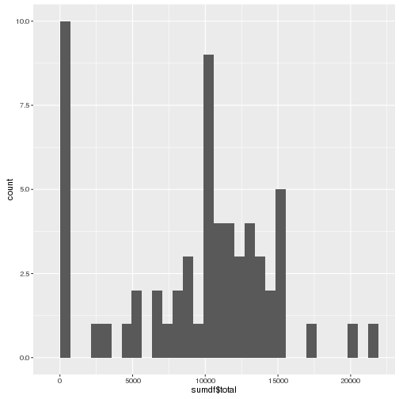

## Load some libraries

```r
library(dplyr)
##library(tidyr)
library(ggplot2)
```

## Loading and preprocessing the data
Load the data file

```r
df <- read.csv("activity.csv")
```

Convert the date column to the date class

```r
df$date <- as.Date(df$date)
```

## What is mean total number of steps taken per day?

Group the data by date and apply the dplyr summarize function to
calculate the total number of steps taken per day

```r
groups <- group_by(df,date)
sumdf <- summarise(groups,sum(steps))
```

Make a histogram of the total number of steps taken each day

```r
qplot(chol$AGE, geom="histogram") 
```

```
## Error in chol$AGE: object of type 'closure' is not subsettable
```

 

## What is the average daily activity pattern?


## Imputing missing values


## Are there differences in activity patterns between weekdays and weekends?
